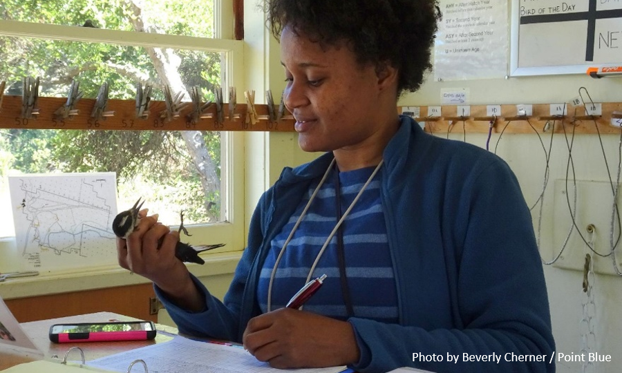

```{r setup, echo = FALSE, warning = FALSE, message = FALSE}
knitr::opts_chunk$set(echo = FALSE, warning = FALSE, message = FALSE, 
                      out.width="95%", fig.asp=0.6)

library(htmltools)
library(bsplus)
library(shiny)

# set up modals for each of the focal species below
bs_modal(id = 'WREN', title = "Wrentit: stable",
         body = tagList(tags$p("Wrentits remain relatively common at Palomarin, despite long-term habitat change and climate change."),
                        tags$img(src = "fig/WREN.jpg", 
                                 width = '400px',
                                 class = 'center'),
                        tags$figcaption("Annual capture rates at the Palomarin Field Station, 1979-2018.")))

bs_modal(id = 'SOSP', title = "Song Sparrow: declining",
         body = tagList(tags$p("Song Sparrows were once one of the most common species at Palomarin, but their numbers have declined locally, thought to be a result of the long-term habitat change."),
                        tags$img(src = "fig/SOSP.jpg", 
                                 width = '400px',
                                 class = 'center'),
                        tags$figcaption("Annual capture rates at the Palomarin Field Station, 1979-2018.")))

bs_modal(id = 'NWCS', title = "Nuttall's White-crowned Sparrow: declining", 
         body = tagList(tags$p("Nuttall's White-crowned Sparrows have declined dramatically as the local vegetation has shifted from open scrub and grassland to dense coastal scrub and Douglas fir forest."),
                        tags$img(src = "fig/NWCS.jpg", 
                                 width = '400px',
                                 class = 'center'),
                        tags$figcaption("Annual capture rates at the Palomarin Field Station, 1979-2018.")))

bs_modal(id = 'SPTO', title = "Spotted Towhee: stable", 
         body = tagList(tags$p("Spotted Towhee populations remain relatively stable at Palomarin."),
                        tags$img(src = "fig/SPTO.jpg", 
                                 width = '400px',
                                 class = 'center'),
                        tags$figcaption("Annual capture rates at the Palomarin Field Station, 1979-2018.")))

bs_modal(id = 'CASJ', title = "California Scrub-Jay: stable", 
         body = tagList(tags$p("California Scrub-Jays are infrequently caught in our mist-nets, in part because they are larger than most of the species we catch and are more easily able to get themselves out! Capture rates are low but steady."),
                        tags$img(src = "fig/CASJ.jpg", 
                                 width = '400px',
                                 class = 'center'),
                        tags$figcaption("Annual capture rates at the Palomarin Field Station, 1979-2018.")))

bs_modal(id = 'WIWA', title = "Wilson's Warbler: declining", 
         body = tagList(tags$p("Wilson's Warbler numbers have declined slightly, but fluctuate year to year, with a relatively high capture rate in 2018."),
                        tags$img(src = "fig/WIWA.jpg", 
                                 width = '400px',
                                 class = 'center'),
                        tags$figcaption("Annual capture rates at the Palomarin Field Station, 1979-2018.")))

bs_modal(id = 'SWTH', title = "Swainson's Thrush: stable", 
         body = tagList(tags$p("Swainson's Thrush numbers have remained steady at Palomarin."),
                        tags$img(src = "fig/SWTH.jpg", 
                                 width = '400px',
                                 class = 'center'),
                        tags$figcaption("Annual capture rates at the Palomarin Field Station, 1979-2018.")))
         
bs_modal(id = 'FOSP', title = "Fox Sparrow: stable", 
         body = tagList(tags$p("Fox Sparrows are relatively steady, except for an unusual spike in their numbers in 2013, possibly the result of an extremely productive nesting season in Alaska."),
                        tags$img(src = "fig/FOSP.jpg", 
                                 width = '400px',
                                 class = 'center'),
                        tags$figcaption("Annual capture rates at the Palomarin Field Station, 1979-2018.")))

bs_modal(id = 'GCSP', title = "Golden-crowned Sparrow: declining", 
         body = tagList(tags$p("Golden-crowned Sparrows have been slowly declining, but with a bump in their numbers in 2013 similar to Fox Sparrow, possibly the result of an extremely productive nesting season in Alaska."),
                        tags$img(src = "fig/GCSP.jpg", 
                                 width = '400px',
                                 class = 'center'),
                        tags$figcaption("Annual capture rates at the Palomarin Field Station, 1979-2018.")))

bs_modal(id = 'HETH', title = "Hermit Thrush: declining", 
         body = tagList(tags$p("Hermit Thrushes have declined slightly over the years."),
                        tags$img(src = "fig/HETH.jpg", 
                                 width = '400px',
                                 class = 'center'),
                        tags$figcaption("Annual capture rates at the Palomarin Field Station, 1979-2018.")))
```

```{js}
//from https://www.dyn-web.com/tutorials/iframes/postmessage/height/

// Get height of document
function getDocHeight(doc) {
    doc = doc || document;
    // from http://stackoverflow.com/questions/1145850/get-height-of-entire-document-with-javascript
    var body = doc.body, html = doc.documentElement;
    var height = Math.max( body.scrollHeight, body.offsetHeight, 
        html.clientHeight, html.scrollHeight, html.offsetHeight );
    return height;
}

// send docHeight onload
function sendDocHeightMsg(e) {
    var ht = getDocHeight();
    parent.postMessage( JSON.stringify( {'docHeight': ht} ), '*' );
}

// assign onload handler 
if ( window.addEventListener ) {
    window.addEventListener('load', sendDocHeightMsg, false);
} else if ( window.attachEvent ) { // ie8
    window.attachEvent('onload', sendDocHeightMsg);
}

// get scroll position from parent for positioning modal?
// https://stackoverflow.com/questions/24805274/bootstrap-modal-at-top-of-iframe-regardless-of-scroll-position-how-do-i-positio
window.addEventListener('message', function(event) {
  var messageContent = event.data.split(':');
  var topOffset = messageContent[0];
  var currentScroll = messageContent[1];

  //calculate padding value and update the modal top-padding
  // from https://stackoverflow.com/questions/32018499/position-bootbox-dynamically-inside-iframe
  $("body").on("shown.bs.modal", ".modal", function() {
     $(this).find('div.modal-dialog').css("top", currentScroll - topOffset + 50 + 'px');
    });
  }, false);

```
<figure>

<figcaption>
Wrentit, one of the Palomarin study species
</figcaption>
</figure>

This question is frequently asked by those who care about birds &mdash; whether they are a scientist, a birder, or simply a nature lover &mdash; and answering it is the key first step to effective bird conservation. Operating year-round since 1966, the Palomarin Field Station provides a unique long-term perspective on West Coast bird populations. 

### Fewer birds at Palomarin

One way to measure the abundance of the local bird community is the number of birds captured as part of our long-term mist-netting and banding study. The bird community changes with the seasons as migrants come and go, so we examine total capture rates of individual birds during each season and overall in each year. Capture rates have declined overall, and especially during the fall season.  

<iframe src="widget/graph_total_capturestats.html"></iframe>
<figcaption>
Annual capture rates at the Palomarin Field Station, 1979-2018, overall total and by season. Select lines at top right to view individual seasons. *Note: Annual totals are calculated March through February of the following calendar year, to keep an entire winter season together.*
</figcaption>

### Why is tracking bird populations important for bird conservation?
Our declining capture rates mirror the continent-wide pattern of declining bird populations across North America, and an estimated [3 billion fewer birds since 1970](https://www.3billionbirds.org){target="_blank"}. In particular, the decline in captures during the fall suggests a reduced number of migratory birds passing through Palomarin on fall migration. By examining long-term variation in capture rates, we can identify individual species that are declining rapidly and determine where and when conservation attention is needed. These declines likely reflect a combination of habitat loss and degradation along [migration routes](connections.html), the additional impacts of [climate change](climate.html) on their ability to raise young and survive each year, and [local habitat changes](habitat.html) that might make Palomarin more or less suitable for individual species. 

Although we study the entire community of birds at Palomarin, we pay particular attention to a suite of focal species to understand how they are doing and what is driving any changes over time. Select a species below to see how annual capture rates of our focal species are changing over time and what this means. 

##### Year-Round Residents
Present at Palo all year, these bird species often maintain their territories even during the nonbreeding season. Changes in the capture rates of these species are most likely to reflect changes to the local habitat and climate. While most of these populations are relatively stable, we have seen declines in Nuttall's White-crowned Sparrows and Song Sparrows, thought to be related to the [local habitat changes](habitat.html).

<div class="row">
<div class="column5">
{#birds}
<figcaption>
```{r}
bs_button("Wrentit") %>% bs_attach_modal(id_modal = "WREN")
```
<br>
  
*Photo by Point Blue*
</figcaption>
</div>
<div class="column5">
{#birds}
<figcaption>
```{r}
bs_button("Song Sparrow") %>% bs_attach_modal(id_modal = "SOSP")
```
<br>
  
*Photo by Miguel Demeulemeester / Point Blue*
</figcaption>
</div>
<div class="column5">
{#birds}
<figcaption>
```{r}
bs_button("Nuttall's White-crowned Sparrow") %>% bs_attach_modal(id_modal = "NWCS")
```
<br>
  
*Photo by Miguel Demeulemeester / Point Blue*
</figcaption>
</div>
</div>

<div class="row">
<div class="column5">
{#birds}
<figcaption>
```{r}
bs_button("Spotted Towhee") %>% bs_attach_modal(id_modal = "SPTO")
```
<br>
  
*Photo by Amon Armstrong / Point Blue*
</figcaption>
</div>
<div class="column5">
{#birds}
<figcaption>
```{r}
bs_button("California Scrub-Jay") %>% bs_attach_modal(id_modal = "CASJ")
```
<br>
  
*Photo by Point Blue*
</figcaption>
</div>
</div>

##### Seasonal Migrants
Present at Palomarin only for part of the year, **Neotropical migrants** spend the spring and summer breeding season with us, then migrate to the tropics of Latin America to spend their winter. Changes in the capture rates of these species may reflect changes in habitat or climate in the tropics, along their [migration routes](connections.html), or local effects of changes at Palomarin.

<div class="row">
<div class="column5">
{#birds}
<figcaption>
```{r}
bs_button("Wilson's Warbler") %>% bs_attach_modal(id_modal = "WIWA")
```
<br>
  
*Photo by Hannah Conley / Point Blue*
</figcaption>
</div>
<div class="column5">
{#birds}
<figcaption>
```{r}
bs_button("Swainson's Thrush") %>% bs_attach_modal(id_modal = "SWTH")
```
<br>
  
*Photo by Ian Tait / Point Blue*
</figcaption>
</div>
</div>

**Neotemperate migrants** spend the summer as far north as Alaska, and then migrate to spend the winter with us. Changes in the capture rates of these species may reflect changes in habitat or climate in Alaska or Canada, along their [migration routes](connections.html), or local effects of changes at Palomarin.

<div class="row">
<div class="column5">
{#birds}
<figcaption>
```{r}
bs_button("Fox Sparrow") %>% bs_attach_modal(id_modal = "FOSP")
```
<br>
  
*Photo by Hannah Conley / Point Blue*
</figcaption>
</div>
<div class="column5">
{#birds}
<figcaption>
```{r}
bs_button("Golden-crowned Sparrow") %>% bs_attach_modal(id_modal = "GCSP")
```
<br>
  
*Photo by Ryan DiGaudio*
</figcaption>
</div>
<div class="column5">
{#birds}
<figcaption>
```{r}
bs_button("Hermit Thrush") %>% bs_attach_modal(id_modal = "HETH")
```
<br>
  
*Photo by Miguel Demeulemeester / Point Blue*
</figcaption>
</div>
</div>

Further research into the specific [migration routes](connections.html) of our local populations of these species would provide additional insights into what is producing the patterns we see at Palomarin and how vulnerable these populations are to changes in habitat and climate.

### How did we collect these data?
<div class="row">
<div class="column-margin-right">

<figcaption>
Former Point Blue intern Francoise Benjamin holding a newly banded woodpecker at the Palomarin Field Station. </figcaption>
</div>
<div class="column">
Since 1966, we have been mist-netting and banding birds at the Palomarin Field Station year-round. All of the birds we capture are carefully recorded and given uniquely-numbered bands provided by the U.S. Bird Banding Laboratory. All of these data are collected by staff, volunteers, and especially the hundreds of interns who have trained at Palomarin over the years. 

For more information on how we carefully capture and band birds to collect this valuable data, please watch our video: [Bird-banding and Mist-netting with Point Blue](https://www.youtube.com/watch?v=8nVXgGhQNXM&feature=youtu.be){target="_blank}
</div>
</div>

### Plan your visit!
Although the Palomarin Field Station is currently closed to the public, we welcome you to plan your visit in the near future. Visitors can drop in and join our intern and staff biologists to learn how we collect this valuable data on bird populations &mdash; and hopefully see a bird in the hand! [More information on visiting and scheduling groups.](https://www.pointblue.org/about-us/contact-visit-us/){target="_blank"}

### Related research
There is much more to learn from these data! You can read more about what we have found here, and please [contact us](mailto:kdybala@pointblue.org) if you are interested in collaborating on future research.

* Dependent vs. independent juvenile survival: contrasting drivers of variation and the buffering effect of parental care. Published in *Ecology*. [[View PDF](http://www.prbo.org/refs/files/12242_DybalaKE2013.pdf){target="_blank"}]

* How safe is mist netting? Evaluating the risk of injury and mortality to birds. Published in *Methods in Ecology and Evolution*. [[View PDF](http://www.prbo.org/refs/files/12125_Spotswood2012.pdf){target="_blank"}]

* Effects of mist netting on reproductive performance of Wrentits and Song Sparrows in central coastal California. Published in *The Condor*. [[View PDF](http://vvvvvv.prbo.org/refs/files/12001_Jennings_etal2009.pdf){target="_blank"}]