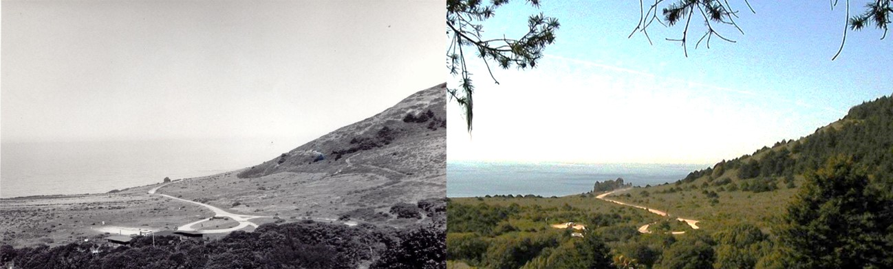
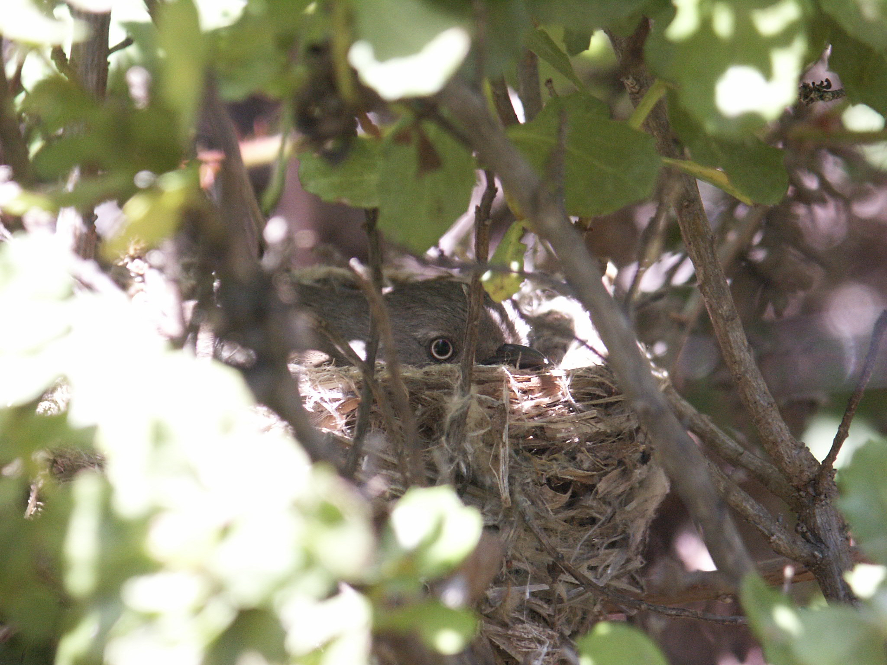
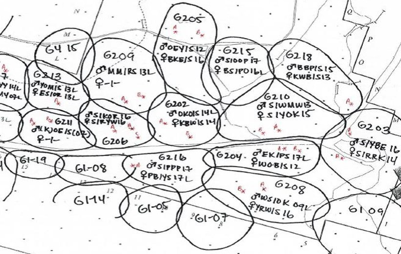

At the Palomarin Field Station we have been monitoring birds and their environment since 1966. Since the beginning of our study, the area adjacent to the mist nets and banding station has undergone drastic habitat change, resulting in dramatic shifts in the local bird community. Tracking the changes in the habitat alongside the changes in bird populations at Palomarin can inform bird conservation as we learn more about what environmental factors are most important for certain species to thrive. Here, you can explore the habitat changes and bird community changes we have recorded through our long-term data collection.

### How has the habitat changed?
During the 15 years before the field station began, the land around Palomarin was partially cultivated for agricultural use and hosted many buildings. Since its inclusion in 1965 into the nascent Point Reyes National Seashore, the land has since been undisturbed and natural habitat succession has taken place. 

<figure>
{#photobar}
<figcaption>
*Overlooking the Palomarin study area in 1970 (left) and 2006 (right). Notice the dark patches of Douglas fir trees on the hillside and in the flats in the 2006 photo.* 
</figcaption>
</figure>

In the earlier years of our study, the landscape at the field station was comprised of two distinct habitat types: the mist-netting and banding site was largely forested while the area adjacent was dominated by short, open coastal scrub.  

Now, the vegetation across the study area has grown in size and structure and has become a complex mix of mature scrub with tall coyote brush, poison pak, California blackberry, and a young, dense Douglas fir forest.

**(Insert figure)**  

*This figure shows the mean height of Douglas fir trees at Palomarin since 1983. Not only have these firs grown in size, our other vegetation data show that the number of trees in the study area, and the height of shrub species like coyote brush, have increased dramatically as well.*

### How has the breeding bird community changed?

  

  
<figure>

<figcaption>
*A Wrentit sitting on a nest. Photo by Dennis Jongsomjit* 
</figcaption>
</figure>

Biologists at Palomarin survey the breeding bird community through mist netting and bird banding, as well as nest searching and territory mapping.  

Every day during the spring and summer, biologists collect data on the movements and behaviors of breeding birds to create territory maps representing that season’s breeding bird activity. The number of territories provides us with a measure of how many breeding individuals of each species are present in the bird community. 

The figure below shows how the breeding bird community has changed over time since 1980. 

**(Insert figure/racing bar chart?)**

*tracking the number of territories of breeding birds at Palomarin through time.*

Extra attention is paid to four primary focal species, which are color-banded so we can more easily identify individuals in the field: Song Sparrows, Nuttall’s White-crowned Sparrows, Wrentits, and Wilson’s Warblers. 

<figure>
<iframe src="territory_trends_focal.html" style="border: none;" width = 100%; height = 450px;></iframe>
</figure>
<figcaption>
Number of territories of our primary 4 focal species at Palomarin since 1982. The number of Song Sparrows and Nuttall’s White-crowned Sparrows have declined, while Wilson’s Warblers have increased since the 80s. Number of Wrentit territories has fluctuated over time.
</figcaption>

### Why is tracking habitat change important for bird conservation?

At Palomarin, we witnessed the open coastal scrub residents that once flourished here fade from the study area while more forest and mixed scrub species moved in. Witnessing and studying this shift has answered some questions, and incited further study to determine what it is that certain species need to survive and thrive. Studying how birds within a community respond differently to changes in their environment provides us with information to help inform and guide conservation efforts. Land management and restoration projects can benefit from this type of research by understanding how best to create an environment that supports a more resilient bird community. 

### How did we collect these data?

During the breeding season (March-July), three interns spend their days stealthily tracking birds to find their nests, and then track how successful each nest is. The interns are trained in how to identify and follow birds by both sound and sight, as well as how to find and safely monitor their nests. A bird that sings in the same area day after day is considered a territorial individual. After months of recording the movements and territorial behavior of individual birds, we compile all of this data into territory maps for each species. 

  

  
<figure>

<figcaption>
*A nest-searching intern observing and recording bird behavior and movement * 
</figcaption>
</figure>

<figure>

<figcaption>
*A territory map for Wrentits in 2018. Each circle represents the territorial area occupied by a breeding pair.* 
</figcaption>
</figure>

Each summer, we collect vegetation data at 8 fixed points throughout the study area. The data helps describe the habitat succession as well as the proliferation and growth of the Douglas fir trees. At each of the 8 points, we record the size (height and width) and species of all woody plants along four 10-meter transects.

### Meet our biologists!
Visitors can drop in at Palomarin to join our intern and staff biologists, learn how we collect this data, and hopefully see a bird in the hand! More information on visiting and scheduling groups is available [here](https://www.pointblue.org/about-us/contact-visit-us/){target="_blank"}.

### More information

Link to a handful of our gridding-related manuscripts.

