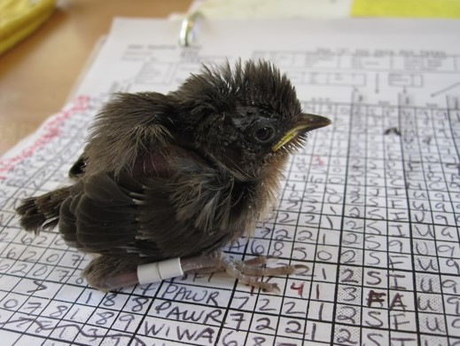

<figure>

<figcaption>
*Color-banded wrentit. Photo by XXX. Testing.* 
</figcaption>
</figure>
The Palomarin Field Station, located at the south end of Point Reyes National Seashore, was established in 1966 and today remains an active field station year-round.

Point Blue staff train field biology interns, host organized groups and drop-in visitors, and collaborate on research with agency partners, graduate students, and others. 

With over 50 years of data, the Palomarin Field Station has made unique contributions to the fields of ornithology, ecology, and conservation. Here, you can explore some of the latest data coming from the field station.

<table style="table-layout: fixed; width:100%;">
<tr>
<th> How are the birds doing?</th>
<th> Tracking a changing climate</th>
</tr>
<tr>
<td>Explore some of the latest capture stats and how they change over time, at one of the oldest, continuously-running banding stations in the United States.</td>
<td>Learn about weather patterns at Palo, and how weather and climate change affect bird populations through migration timing, body size, and more.</td>
</tr>
<tr>
<th> Habitat & community change</th>
<th> Crossroads & connections</th>
</tr>
<tr>
<td>Take a tour of the habitat changes in the Palomarin study area since 1966, and see how the bird community is responding.
</td>
<td>See how Palomarin is home to birds migrating from thousands of miles away, and how we find out where they come from to inform conservation.</td>
</tr>
</table>
