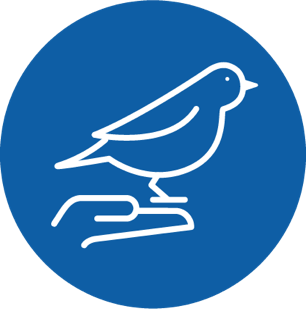
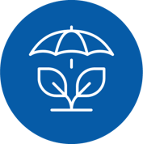

## Data Explorer

```{r setup, echo = FALSE, warning = FALSE, message = FALSE}
knitr::opts_chunk$set(echo = FALSE, warning = FALSE, message = FALSE, 
                      out.width="95%", fig.asp=0.6)

library(htmltools)
library(bsplus)
library(shiny)

bs_carousel(id = 'palo', use_indicators = TRUE, use_controls = FALSE) %>% 
  bs_append(content = bs_carousel_image(src = 'fig/palo_building_caption.png')) %>% 
  bs_append(content = bs_carousel_image(src = 'fig/banding_intern_Francoise_caption.png')) %>% 
  bs_append(content = bs_carousel_image(src = 'fig/wren_eggs_caption.png')) %>% 
  bs_append(content = bs_carousel_image(src = 'fig/banding_lab_caption.png')) %>% 
  bs_append(content = bs_carousel_image(src = 'fig/KTCH2018_summer_caption.png')) %>% 
  bs_append(content = bs_carousel_image(src = 'fig/WREN23_byDennisJongsomjit_caption.png'))

```

```{js}
//from https://www.dyn-web.com/tutorials/iframes/postmessage/height/

// Get height of document
function getDocHeight(doc) {
    doc = doc || document;
    // from http://stackoverflow.com/questions/1145850/get-height-of-entire-document-with-javascript
    var body = doc.body, html = doc.documentElement;
    var height = Math.max( body.scrollHeight, body.offsetHeight, 
        html.clientHeight, html.scrollHeight, html.offsetHeight );
    return height;
}

// send docHeight onload
function sendDocHeightMsg(e) {
    var ht = getDocHeight();
    parent.postMessage( JSON.stringify( {'docHeight': ht} ), '*' );
}

// assign onload handler 
if ( window.addEventListener ) {
    window.addEventListener('load', sendDocHeightMsg, false);
} else if ( window.attachEvent ) { // ie8
    window.attachEvent('onload', sendDocHeightMsg);
}
```

###### Welcome! We invite you to explore and learn about birds from over 50 years of data collected by Point Blue staff and interns at the Palomarin Field Station. 
 
Since 1966, the Palomarin Field Station has been a constant hub of field biology research, training, and outreach. Located in the Point Reyes National Seashore, Palomarin is one of the oldest field stations in Western North America, and our research has made unique contributions to the fields of ornithology, ecology, and conservation. We also provide high quality training to field biology interns each year, many of whom go on to become professionals in research and conservation. We maintain a Nature Center that is open to the public, and enjoy hosting organized groups and drop-in visitors to share the joy of birds and science!

Here, you can dive deep into some of the most important science stories from Palomarin, and explore data that spans decades.

<div class="row">  
<div class="column-margin">  
[{#icon}](https://www.pointblue.org/our-work/keystone-datasets/how-are-the-birds-doing/){target="_parent"}  

#### [How are the birds doing?](https://www.pointblue.org/our-work/keystone-datasets/how-are-the-birds-doing/){target="_parent"}  

Explore some of the latest bird numbers and how they change over time at one of the oldest, continuously-running banding stations in the United States.  
</div>  
<div class="column-margin">  
[{#icon}](https://www.pointblue.org/our-work/keystone-datasets/tracking-a-changing-climate/){target="_parent"}
  
#### [Tracking a changing climate](https://www.pointblue.org/our-work/keystone-datasets/tracking-a-changing-climate/){target="_parent"}  

Learn about weather patterns at Palomarin, and how weather and climate change affect bird populations through changes in migration timing, body size, and more.  
</div>  
</div>
<div class="row">
<div class="column-margin">  
[{#icon}](https://www.pointblue.org/our-work/keystone-datasets/habitat-and-community-change/){target="_parent"}

#### [Habitat & community change](https://www.pointblue.org/our-work/keystone-datasets/habitat-and-community-change/){target="_parent"}  

Take a tour of the habitat changes in the Palomarin study area since 1966, and see how the bird community is responding.  
</div>  
<div class="column-margin">  
[{#icon}](https://www.pointblue.org/our-work/keystone-datasets/crossroads-and-connections/){target="_parent"}

#### [Crossroads & connections](https://www.pointblue.org/our-work/keystone-datasets/crossroads-and-connections/){target="_parent"}  

See how Palomarin is home to birds migrating from thousands of miles away, much like the hundreds of interns who have studied them here, and how we find out where birds come from to inform conservation.  
</div>  
</div>  

### Plan your future visit!
Although the Palomarin Field Station is **temporarily closed to the public due to COVID-19**, we welcome you to plan your visit in the near future. We are located at the south end of the [Point Reyes National Seashore](https://www.nps.gov/pore/index.htm){target="_blank"}, where nearly 490 bird species have been recorded, the greatest number of any national park! Visitors can drop in and join our intern and staff biologists to learn how we collect this data &mdash; and hopefully see a bird in the hand! [More information on visiting and scheduling groups.](https://www.pointblue.org/about-us/contact-visit-us/){target="_blank"}
